# Interactive Product Catalog Overview [QuickMart]

**Live Link:** https://interactive-product-catalog.netlify.app/

**Description:**

This project is a web application consisting of various components to create an interactive product catalog. It allows users to browse through products, view product details, login/logout, handle errors, and manage their cart. The application integrates with Auth0 for authentication and Stripe for payment processing.

**Components:**

1. Hero Section Component: 

Displays a visually appealing section at the top of the page, often used for showcasing featured products or promotional content.

2. Product Showcase Component: 

Shows a collection of products in an organized manner, allowing users to browse through them easily. Each product usually includes an image, title, and brief description.

3. Single Product Component: 

Displays detailed information about a single product, including its image, description, price, and options for customization if applicable.

4. Categories Component:

Provides a way for users to sort products by price [low, high], making it easier for them to find what they're looking for.

5. Login / Logout Component: 

Allows users to authenticate themselves by logging in or out of their accounts. Firebase authentication is utilized for secure user authentication.

6. Error and Cart Empty Components: 

Handles various types of errors that may occur during the user's interaction with the application. Additionally, provides a visually pleasing message when the user's cart is empty.

7. Payment Gateway:

Allow Payments by stripe

**Tech Stack**

**Frontend:**

1. **React.js:** A JavaScript library for building user interfaces.

2. **CSS:** Used for styling the components and providing visual enhancements.

3. **JavaScript:** The primary programming language for implementing dynamic behavior and interactivity.

4. **React-toastify:** Style and customize toast messages in React apps so users receive appropriate feedback for their actions.

**Backend:**

1. **Express:** A web application framework for Node.js, used for building the server-side logic and APIs.

**Authentication:**

1. **Firebase:** A flexible authentication and authorization , used to handle user authentication securely.

**Payment Gateway:**

1. **Stripe:** A payment processing platform, integrated into the application to handle online payments securely.

**Improvement**

1. Enhance the styling and design of the components to create a more visually appealing interface.

2. Implement responsive design to ensure the application is accessible and usable across different devices and screen sizes.

# Project Flow

```mermaid
graph TD;
    Home-->D[Shop By Category]-->CategoryA;
    D[Shop By Category]-->CategoryB;
    D[Shop By Category]-->...etc;
    Home-->Navbar-->Home;
    Navbar-->|product adding flow|A[Men category];
    Navbar--> B[Women category];
    Navbar--> C[Login/Logout];
    Navbar-->|If logged in|Cart;
    Navbar-->|If not logged in|Login;
    Login-->Cart;
    Cart-->|add count/remove item|Products;
    Cart-->|clear Cart|Clear;
    Cart-->Home;
    Cart-->Checkout-->E[stripe payment gateway]-->|fulfilled|success;
    E[stripe payment gateway]-->|cancellation|cancel;
    A[Men category]-->|with sortby feature|G[product List]-->H[Single Product info]-->I[add to cart]-->Cart
```

**Note: Additional features to be implemented in the future**
